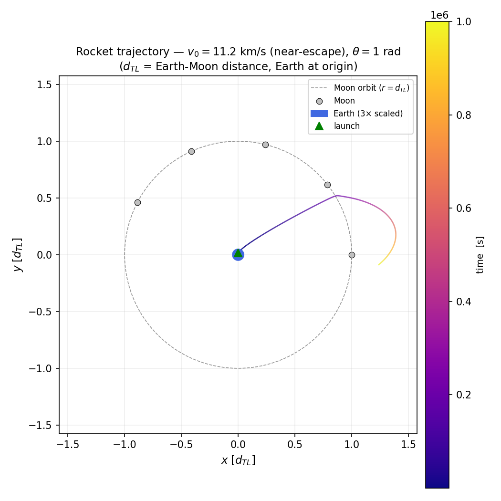
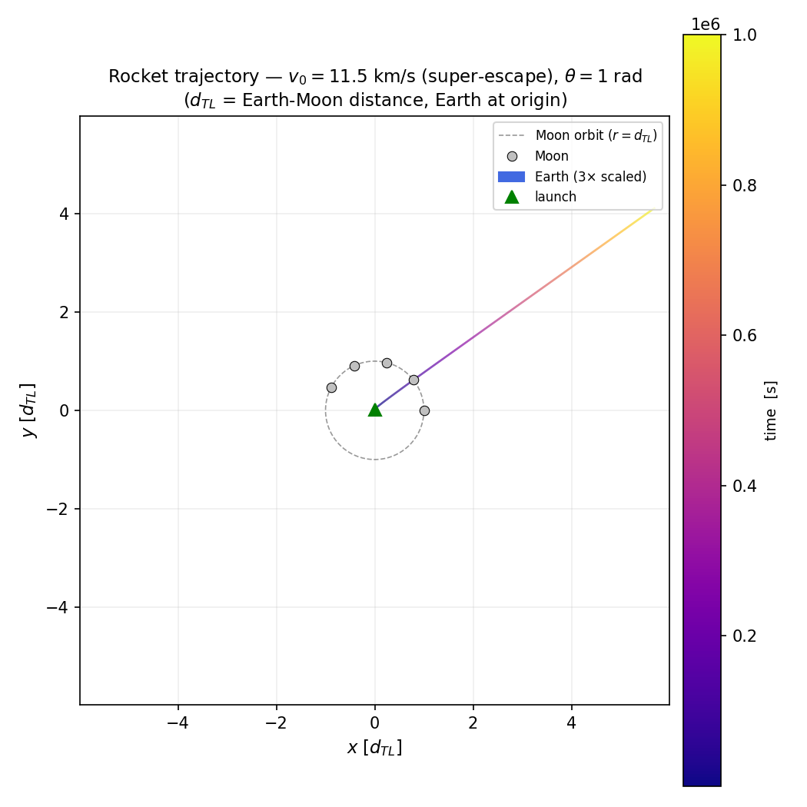
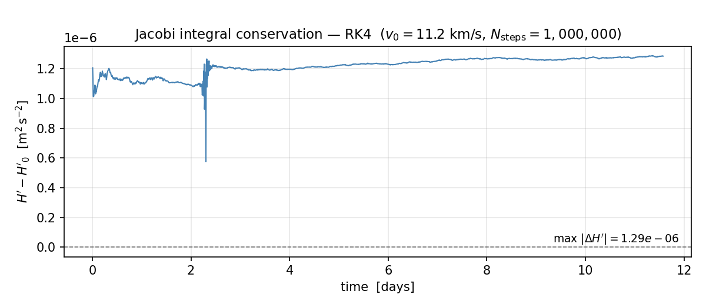
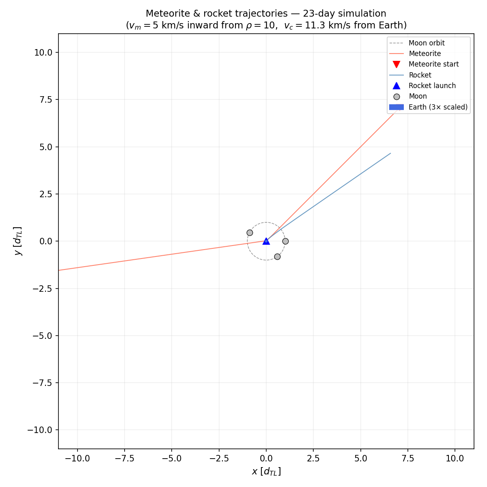
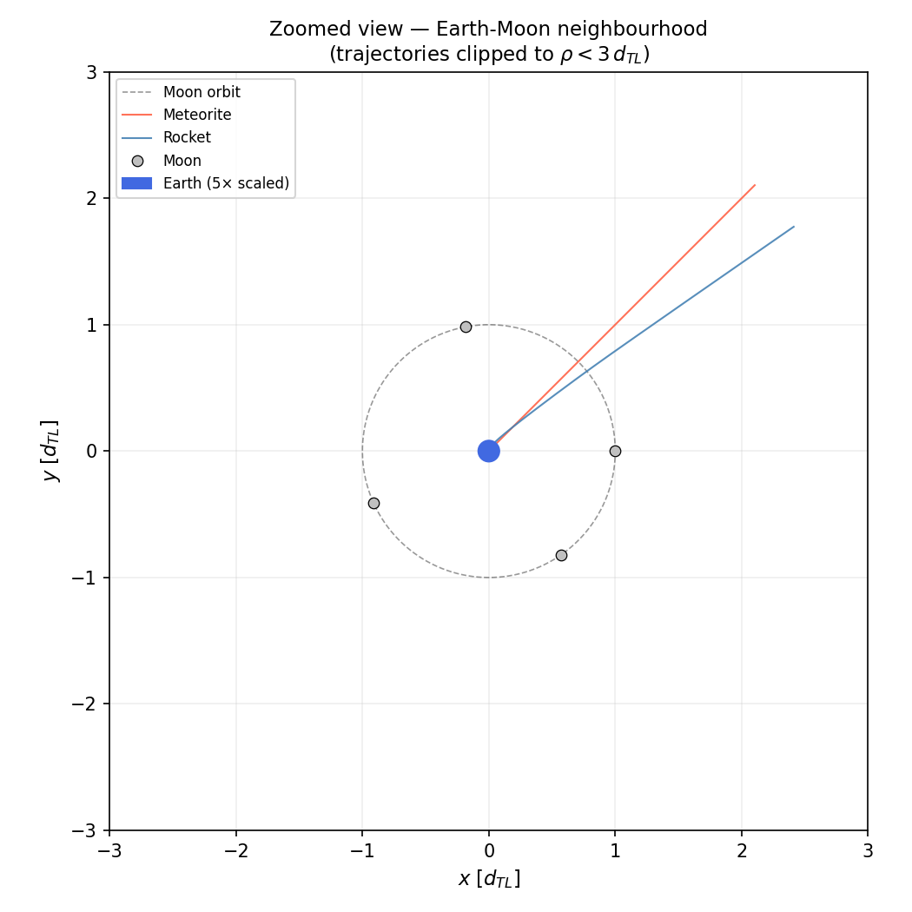

# Earth-Moon Restricted Three-Body Problem

Python implementation of the **Runge-Kutta 4 (RK4)** integrator for spacecraft and meteorite trajectories in the Earth-Moon gravitational field.  Models the **restricted circular three-body problem** (Earth + Moon + massless test particle) in polar coordinates centered on Earth.  Includes Jacobi integral conservation as an accuracy diagnostic.

---

## Repository layout

```
├── rocket/
│   ├── dynamics.py             # Equations of motion + RK4 integrator (Numba JIT)
│   └── initial_conditions.py   # Launch ICs, meteorite ICs, Jacobi integral
├── scripts/
│   ├── run_rocket.py           # Rocket trajectories + Jacobi conservation → 3 figures
│   └── run_meteorite.py        # Meteorite + rocket combined → 2 figures
└── figures/                    # All PNG outputs (generated by the scripts)
```

---

## Physics

### Restricted circular three-body problem

Earth is fixed at the origin.  The Moon orbits Earth at constant angular velocity

$$
\omega = 2.6617 \times 10^{-6}\ \mathrm{rad\,s^{-1}}
$$

with orbital radius $d_{TL} = 3.855 \times 10^8$ m (mean Earth-Moon distance).  A massless test particle (rocket or meteorite) moves under the gravitational fields of both bodies.

**Dimensionless polar coordinates:** $\rho = r / d_{TL}$, $\varphi$.  
Earth at $\rho = 0$, Moon at $\rho = 1$, $\varphi_{\rm Moon}(t) = \omega t$.

### Equations of motion

The canonical momenta are $p_\rho = \dot\rho$ and $p_\varphi = \rho^2\dot\varphi$ (specific angular momentum in $d_{TL}^2\,\mathrm{s}^{-1}$).  Hamilton's equations give

$$
\dot\rho = p_\rho, \qquad
\dot\varphi = \frac{p_\varphi}{\rho^2}
$$

$$
\dot p_\rho = \frac{p_\varphi^2}{\rho^3} - \Delta\!\left[\frac{1}{\rho^2} + \frac{\mu(\rho - \cos(\varphi - \omega t))}{\rho'^3}\right]
$$

$$
\dot p_\varphi = -\frac{\Delta\,\mu\,\rho\sin(\varphi - \omega t)}{\rho'^3}
$$

where

| Symbol | Value | Meaning |
|--------|-------|---------|
| $\Delta = G(M_\oplus + M_{\rm Moon})/d_{TL}^3$ | $7.015\times10^{-12}\ \mathrm{s}^{-2}$ | normalized gravitational constant |
| $\mu = M_{\rm Moon}/(M_\oplus + M_{\rm Moon})$ | $0.01230$ | Moon mass fraction |
| $\rho' = \sqrt{1 + \rho^2 - 2\rho\cos(\varphi - \omega t)}$ | — | particle-to-Moon distance [d_TL] |

### Jacobi integral

Because the Moon orbits at constant $\omega$, the co-rotating frame Hamiltonian is time-independent.  The conserved quantity is

$$
\mathcal{J} = \underbrace{d_{TL}^2\!\left[\frac{p_\rho^2}{2} + \frac{p_\varphi^2}{2\rho^2} - \frac{\Delta}{\rho} - \frac{\mu\Delta}{\rho'}\right]}_{H\ \text{(specific energy)}} - \omega\,p_\varphi\,d_{TL}^2
$$

$\mathcal{J}$ is **exactly conserved** for circular lunar orbits and serves as a precision diagnostic for the RK4 scheme.

### RK4 integrator

Standard fourth-order Runge-Kutta with fixed time step $h = 1\ \mathrm{s}$, applied to the four-dimensional phase-space vector $(\rho, \varphi, p_\rho, p_\varphi)$.  Inner loops are compiled with **Numba `@njit`**, reducing 10⁶-step integrations to a few seconds.
---
## Initial conditions

### Rocket (from Earth's surface)

$$
\rho_0 = \frac{R_\oplus}{d_{TL}} \approx 0.01655, \quad \varphi_0 = \frac{\pi}{2}
$$

$$
p_{\rho,0} = v_0\cos(\theta - \varphi_0), \qquad p_{\varphi,0} = \rho_0\,v_0\sin(\theta - \varphi_0)
$$

with launch speed $v_0$ and direction angle $\theta$ in the inertial frame.

Earth's escape velocity is $v_{\rm esc} = \sqrt{2G M_\oplus / R_\oplus} \approx 11.18\ \mathrm{km\,s^{-1}}$.

### Meteorite (from deep space)

Starts at $\rho_0 = 10\,d_{TL}$ ($\approx 3.9 \times 10^9$ m from Earth) with purely inward radial velocity $v_0 = 5\ \mathrm{km\,s^{-1}}$.
---
## Results

### Trajectory comparison: near-escape vs. hyperbolic

| $v_0 = 11.2\ \mathrm{km\,s^{-1}}$ — near-escape | $v_0 = 11.5\ \mathrm{km\,s^{-1}}$ — hyperbolic |
|:---:|:---:|
|  |  |

At $v_0 \approx v_{\rm esc}$ the rocket barely escapes Earth, passes through the Moon's orbital zone, and is significantly deflected by lunar gravity (visible curve near $\rho = 1$).  At $v_0 = 11.5\ \mathrm{km\,s^{-1}}$ the trajectory is nearly hyperbolic: the rocket crosses the Moon's orbit in ~1 day and escapes the Earth-Moon system within the 11.6-day simulation window.

### Jacobi integral conservation



The RK4 scheme conserves $\mathcal{J}$ to within $\sim 10^{-6}\ \mathrm{m^2\,s^{-2}}$ over $10^6$ steps — a **fractional error below $10^{-13}$** relative to the total specific energy ($\sim 6 \times 10^7\ \mathrm{m^2\,s^{-2}}$).  The spike near day 2 corresponds to the closest lunar approach, where the force gradient is steepest and the fixed time step introduces its largest local error.

### Meteorite + rocket (23-day simulation)

| Wide-field view | Zoomed Earth-Moon neighbourhood |
|:---:|:---:|
|  |  |

The meteorite (red) falls from $\rho = 10$ on a nearly radial trajectory, accelerated by Earth's gravity as it approaches.  The rocket (blue, $v_0 = 11.3\ \mathrm{km\,s^{-1}}$, $\theta = \pi/3$) is launched simultaneously and escapes outward in a different direction.  The two particles are gravitationally independent (no rocket propulsion, no collision model); the simulation illustrates the distinct phase-space regions accessible from each set of initial conditions.
---
## Usage

```bash
pip install numpy numba matplotlib
```

```bash
python scripts/run_rocket.py
python scripts/run_meteorite.py
```

Both scripts write PNG figures to `figures/` and print progress to stdout.

> **Numba JIT compilation**: the first run compiles the inner loops (~5–15 s). Subsequent runs use the cached bytecode and are significantly faster.
---
## Author

**A. S. Amari Rabah**

Developed as part of the coursework for *Computational Physics* —
Bachelor's Degree in Physics, University of Granada, Spain.